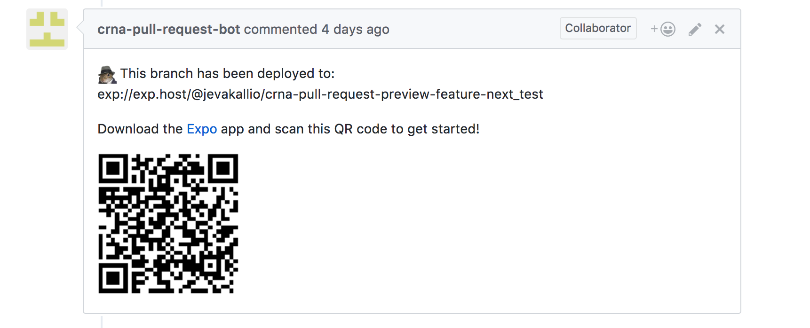

# Testing pull requests with _appr_

## TL;DR;

Made by [Formidable](https://formidable.com), [appr](https://github.com/formidablelabs/appr) builds and deploys pull requests in your [create-react-native-app](https://github.com/react-community/create-react-native-app) and [Expo](https://expo.io/)-based projects, and posts a link and a QR code to your PR, so you can run the app on your device or emulator in seconds!

## Great teams review their code

I'm sure you'll agree: Code reviews are a useful tool in a development team's workflow. You wouldn't release code to production without having another pair of eyes on it first, would you?

Thankfully, GitHub makes code reviews simple. As long as the team is disciplined enough to keep their pull requests small and focused, code keeps getting reviewed, improved, fixed and released. But as soon as reviewing become slow, the flow grinds to a halt.

A good code review looks at code conventions, patterns, and architecture. But most importantly, **good reviews verify that the code works as intended.** For UI programming, the only way to do this try out the app. To get another developer's code running on your device you will have to stash any work-in-progress in your own workspace, pull down the remote branch, install dependencies, compile, deploy and start the application. Not so quick, anymore, is it?

## Review apps

I've loved [Heroku](https://www.heroku.com/)'s GitHub-integrated [Review Apps](https://devcenter.heroku.com/articles/github-integration-review-app) since they were launched. As part of your branch build, Heroku will spin up a new instance of your web application, which you can then access with a direct link from your GitHub pull request. [Netlify](https://www.netlify.com/) offers the same functionality for deploying static frontend sites.

Sadly, this one-click workflow hasn't been available to mobile developers without setting up complex build and deployment pipelines, and even then, installing an app to be able to test a simple change still takes too damn long.

Inspired by [Expo Sketch](https://sketch.expo.io/), I wanted to see if it would be possible to set up review apps for React Native.

## Introducing _appr_

Appr is a script that deploys pull requests in your project to Expo, and posts a link and a QR code to your PR. **It works just like Sketch, but for your entire project.** Point your Expo app camera to the QR code, and the review app will launch on your device. Appr currently works with all unejected Expo apps, including apps created with [create-react-native-app](https://github.com/react-community/create-react-native-app).

The default build environment is [Travis](https://travis-ci.org/), a popular continuous integration service that is free for open source projects, and offers paid plans for private repositories. Switching to your preferred CI should be easy, and PRs to add support are welcome!

To make testing your pull requests easy, head on to [FormidableLabs/appr](https://github.com/FormidableLabs/appr) on GitHub and follow the simple [Getting started](https://github.com/FormidableLabs/appr#getting-started) guide to add appr to your project!

## About the author

_Jani builds React Native apps at [Formidable](https://formidable.com), a Seattle/London-based consultancy and open-source shop. You can follow him on Twitter as [@jevakallio](https://twitter.com/jevakallio)._
